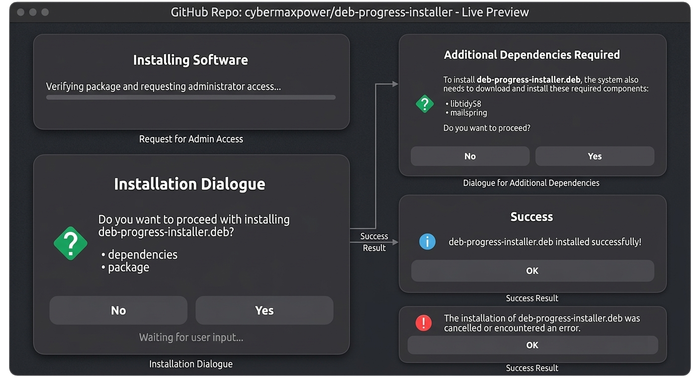

# Deb-progress-installer

<p align="center">
  
</p>

A lightweight graphical utility that uses [Zenity](https://github.com/GNOME/zenity) to show a visual progress bar while installing local Debian (`.deb`) packages.


## 💡 Motivation: Why This Was Created

This utility was born out of frustration with the current state of local package installation on modern Linux distributions. 

For years, tools like `GDebi` were the open-source standard, but they are no longer under active development. This legacy code causes them to frequently freeze or crash on modern desktop environments like Ubuntu 26.04. Meanwhile, default Software Centers have become heavily bloated, slow to load, and often push users toward Snaps rather than a simple local installation.

### How It Differs From Tools Like `deb-get`:
* **A GUI-First Experience:** Unlike CLI utilities like `deb-get`—which focus on downloading popular third-party software from the terminal—`deb-progress-installer` acts as a native desktop mouse-click handler. It is designed for those who just want to double-click a local file in their file manager.
* **Granular Progress Tracking:** Standard command-line tools often hide what they are doing behind dense text walls. This tool uses a clean, visual Zenity progress bar that parses the installation frame-by-frame, tracking granular stages like data unpacking, dependency resolution, and real-time backend configuration so you are never left guessing if your installation is stuck.

`deb-progress-installer` fills this gap perfectly: a dead-simple, blazing-fast, and reliable native tool that does one thing and does it well—installing your local packages with beautiful, real-time graphical progress tracking without any of the baggage.


---

## 🚀 One-Time Setup


### Manual Download (Ubuntu / Zroin / Debian / LMDE)

You can install the package directly without needing any external repositories. This works perfectly on Ubuntu, Debian, and other supported Linux distributions:

[](https://github.com/cybermaxpower/deb-progress-installer/releases/latest/download/deb-progress-installer.deb)

#### Method A: Graphical Install (Easiest)
1. Click the **Download .deb Installer** button above.
2. Double-click the downloaded file in your **Downloads** folder to open your system's Software Store.
3. Click **Install**.

#### Method B: Quick Terminal Install
If you prefer the command line, copy and paste this single command. It downloads the release securely and automatically installs any missing tools (like `zenity`):

```bash
wget -O /tmp/installer.deb https://github.com/cybermaxpower/deb-progress-installer/releases/latest/download/deb-progress-installer.deb && sudo apt install /tmp/installer.deb
```

## 🛠️ How to Enable & Use It
Once installed, you need to tell your file manager to use this tool to open Debian packages. You only have to do this once!

### Step 1: Set the Default Handler
Find any .deb file on your computer (for example, in your Downloads folder).

Right-click the .deb file.

Select Open With Other Application (or Properties -> Open With, depending on your desktop layout).

Look through the list and select Deb Installer.

Click the Set as Default button.

### Step 2: Run an Installation
From now on, whenever you want to install a software package:

Simply double-click or right-click -> Open With any .deb file.

A clean, visual Zenity progress bar will pop up to show you exactly how the installation is progressing!

## 🔍 How It Works (Extended Description)
Standard command-line tools like dpkg don't natively provide a graphical progress readout, which can leave desktop users wondering if an installation is stuck.

deb-progress-installer acts as an intelligent, lightweight wrapper that bridges the gap between the Debian package management backend and the desktop environment.

Behind the Scenes:
Root Privilege Handling: The application leverages pkexec or sudo to securely elevate permissions, ensuring safe package execution.

Terminal Parsing: It triggers a non-interactive dpkg installation process and actively intercepts the standard output (stdout) streams.

Regex Status Filtering: The core script monitors specific packaging triggers, such as unpacking, setting up, and configuring dependencies.

Zenity UI Generation: It parses those terminal triggers in real-time, instantly converting raw text percentages into a smooth, native GTK graphical progress bar via zenity.

## Development Notes
This application was designed and developed in collaboration with Google Gemini, utilizing AI-assisted software engineering to build the core utility and structure the native Debian packaging pipeline.
